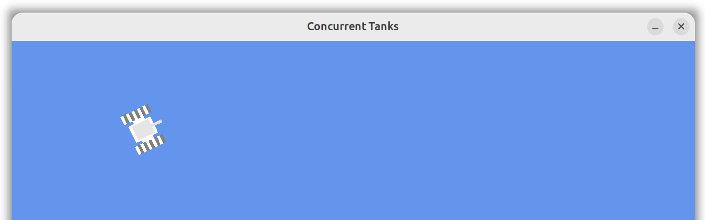

Running the Application

Launch the project from Visual Studio.

All required OpenGL libraries are included as NuGet packages.

Controls

Use the W, A, S, and D keys to control the tank:

W – Move forward
S – Move backward
A – Rotate left
D – Rotate right

  

